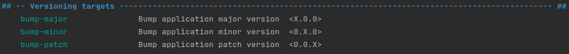

# Contributing to this repository

## Adding dependencies

Please make sure to add dependencies using `Poetry`, so the project environment
is kept up to date and functional for other users.

To add a new dependency:

```
poetry add <dependency_name>
```

To add a new dependency with a specific version:

```
poetry add "<dependency_name>==<x.x.x>"
```

To add a new dependency to a specific group of dependencies 
(for example, the development dependencies):

```
poetry add --group dev <dependency_name>
```

## Design patterns
Two main considerations should be made when contributing to this package.

First, a polymorphic approach, using abstract classes and their concrete implementation,
should be prioritized in order to increase maintainability and extensibility.

Therefore, new additions should try to follow this design pattern and either implement
new concrete classes or create new abstract classes and their implementations for 
completely new behavior or needs.

Avoid multiple levels of inheritance; the approach should be _AbstractClass -> 
[ConcreteClass1, ConcreteClass2, ...]_ and not 
_AbstractClass -> ChildClass -> GrandChildClass -> ..._

Next, a dependency-injection approach is to be preferred, as well as a composition 
approach when creating new modules or extending existing ones.

Functional approaches are also acceptable when appropriate, but classes should still
be used for data management/representation. This can be done with either regular 
classes, `dataclasses`, or `pydantic` models.

## Tests

New contributions should include appropriate tests. Pytest is the preferred library to 
use for testing in this project.

To get started and to learn more about testing in Python:

* [Getting started with testing](https://realpython.com/python-testing/)
* [Testing in the contest of Machine Learning](https://fullstackdeeplearning.com/course/2022/lecture-3-troubleshooting-and-testing/)
* [Pytest Documentation](https://docs.pytest.org/en/stable/how-to/index.html)

## Docstring and type hinting

Docstring format should follow the Numpy standard and type hinting should be used
as per the PEP8 standard : https://docs.python.org/3/library/typing.html

## Version management and Changelogs

Changes to this repository should be tracked in the [CHANGES.md](CHANGES.md) file.

Actual version handling should be done using the following targets:


