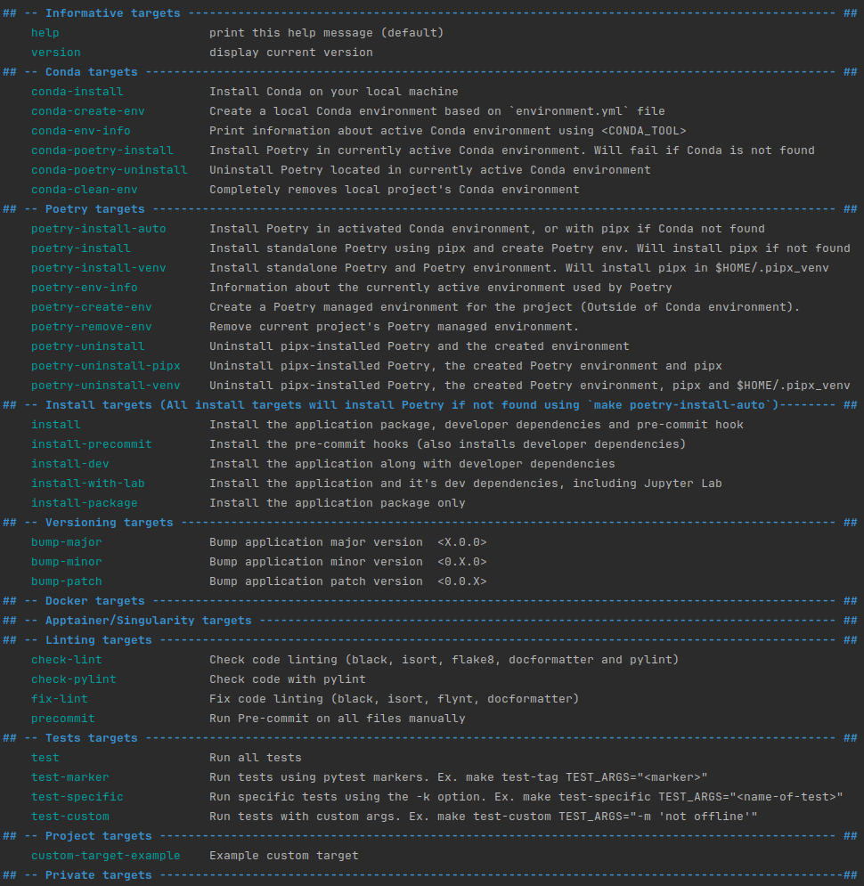

# My Python project template
This template was initially developed by Francis Pelletier <fplt.softwaredeveloper@gmail.com>.

## Description

Repository template that features automation and advanced tools to help me make nice looking projects. 
This template is intended to be used for libraries or applications that will be maintained, 
and even possibly distributed over time.

This is ideal for large team projects where tools and configurations are abstracted 
away in order for team members to focus on the code and purpose of the project instead 
of the *how* things are configured.

The purpose of this template is to help with code quality, structure and reproducibility 
while also enabling best practices for longer term projects.

There is, however, a learning curve that comes with these benefits, and you should seek 
support if this is the first time you are starting a project with this template or 
if you are not familiar with tools like `Makefile`, `nox`, `pre-commit` and `poetry`.

This template creates a python package, contained in [src/](src/) (could be renamed; see instructions below), 
that will contain your different modules.

For more information about python packages and modules, 
[Python Modules and Packages – An Introduction](https://realpython.com/python-modules-packages/).

## Initialization

Please follow these steps:

1. Set up the repository:
   * Automatic way - On the template's GitHub page (TODO link), 
     create a new repository by using the `Use this template` button, near the top right corner. 
     Do not include all branches.
     * If you already have existing code, transfer it either in [src/](src/) or [scripts/](scripts/), 
       depending on it's nature
       * Modules (python code that is meant to be _imported_ in other python files) should go into the 
         [src folder](src/README.md)
       * Python scripts that are meant to be executed via the command line
         should go into the [scripts folder](scripts/README.md)

   * It can also be done manually (though longer and more error-prone):
      1. Clone or download the `my-python-project-template` repository (this repository)
      2. Either start a new GitHub repository, or select an existing one (the target repository)
      3. Copy the files and folders of the `my-python-project-template` repository into your target repository.
         * Do not copy the `.git` folder from the `my-python-project-template`.
         * Move your existing code
           * Modules (python code that is meant to be _imported_ in other python files) should go into the 
             [src folder](src/README.md)
           * Python scripts that are meant to be executed via the command line
             should go into the [scripts folder](scripts/README.md)
2. Rename the python package (optional step) - This will allow you to use `from <package_name> import ...` 
   instead of `from src import ...`  :
   1. Rename [src folder](src) to your package name
      * Make sure the name in `snake_case`, like other python modules and packages.
      * Bad examples : `my-package`, `MyPackage`, `My Package`
      * Good example : `my_package`
   2. Set the package name on line #2 of the [pyproject.toml](pyproject.toml) file by replacing `src` with the 
      same name used above.
   3. Adjust the *src/* folder name consequently in the [noxfile.py](noxfile.py)
   4. Adjust the *src/* folder name consequently in the [utils imports](src/utils.py)
3. Write your name on line #5 in [pyproject.toml](pyproject.toml), and write a short description on line #4
4. Make sure to rename the following:
   * Environment name in [environment.yml](environment.yml)
   * `APPLICATION_NAME` and `CONDA_ENVIRONMENT` in [Makefile.variables](Makefile.variables)
   * Update <REPOSITORY_URL> to real repository url in both [CHANGES.md](CHANGES.md) and [pyproject.toml](pyproject.toml)
5. Follow the rest of the instructions in this README
6. Remove this section (_Initialization_) from the README of your target repository and modify it's title 
   and description

Installing this package for the first time (see [Installation](#installation)) 
will create the `poetry.lock` file, which will set the different library versions used 
by the project, and therefore help with reproducibility and reduce the classic but 
annoying "but it works on my machine" situation.

However, this `poetry.lock` file can be problematic when using locally compiled python 
wheels.

If working on multiple different clusters, it might be better to add the `poetry.lock` 
file to your `.gitignore`, and manage your dependencies with either explicit versions or 
with [Tilde requirements](https://python-poetry.org/docs/dependency-specification/#tilde-requirements).

## Requirements

This project has only been tested in a Linux (Debian based) environment and assumes
some basic tools for development are already installed.

The project uses a Makefile to automate most operations. If `make` is available on your 
machine there's a good chance this will work.

The following Makefile files should not be modified, but can be consulted:

* [Makefile](Makefile) : Orchestration of the different files
* [base.make](.make/base.make) : Shared utilities, project agnostic.

The following Makefile files are project or user specific:

* [Makefile.variables](Makefile.variables) : Shared project variables.
* [Makefile.targets](Makefile.targets) : Shared project targets.
* [Makefile.private](Makefile.private.example) : User specific variables and targets.

## Basic Information

The different targets and their description can be examined by executing the command
`make targets`



## Python Version

This project uses Python version 3.11

## Build Tool

This project uses `poetry` as a build tool. Using a build tool has the advantage of 
streamlining script use as well as fix path issues related to imports.

## First Time User Quick Setup

### Installing poetry

Installing `pipx` and `poetry`:

```shell
make poetry-install
```

Next, let's choose how to manage our development environment

### Environment management choice

Choose between managing your development with either `poetry` or `conda`.

#### Poetry

Make sure that `python 3.11` is available either locally, through loaded cluster 
modules (ex. `module load python/<PYTHON_VERSION>`) or `pyenv` before executing the 
following command:

```shell
make poetry-create-env
```

Make sure to read up on [how to use your poetry virtual environment](https://python-poetry.org/docs/basic-usage/#using-your-virtual-environment)

You can:
* Use the `poetry run` command to access your executables
  * ex. `poetry run python your_script.py`, or `poetry run pylint src/`
* Use the `poetry shell` command to activate and step in your project environment

#### Conda

If working on a cluster, first load the appropriate module : 
`module load miniconda/3`

1. Create `conda` environment (will check for `conda` and install it if not found):

```shell
make conda-create-env
```

2. Activate `conda` environment (substitute with your <CONDA_TOOL> if something else 
than `conda`:

```
conda activate <environment_name>
```

### Install

Once the environment is taken care of, you can verify everything with the following 
command before continuing:

```shell
make poetry-env-info
```
or
```shell
poetry env info
```

and then install the package and it's dependencies:

```shell
make install
```

### Development

1. [Add required dependencies](./CONTRIBUTING.md#adding-dependencies)
2. Create some new modules in the [src](src/) folder!

## Detailed documentation

This project assumes environment management will be done with `conda`, classic 
python virtual environment, or directly through 
`poetry`. 

* [Poetry](https://python-poetry.org/docs/basic-usage/)
* [Conda](https://conda.io/projects/conda/en/latest/user-guide/getting-started.html)

While it is possible to manage the environment with, for example, pyenv or virtualenv, 
those specific use cases are not supported by the Makefile and require users to set up 
their own environments beforehand.

If you want to use something else than `conda` or `poetry` to manage environment isolation, 
it is recommended to follow 
[Poetry's guidelines on managing environments](https://python-poetry.org/docs/managing-environments/)

`poetry` is not included in the [environment.yml](environment.yml), due to some possible problems
in compute cluster environments, but will be installed automatically if needed
by most `install` targets.

See [Environment and Install targets](docs/makefile_environment_targets.md) for more 
information.

### Environment Management

Your project will need a virtual environment for your dependencies.

* [How to create a Conda environment](docs/conda_environment_creation.md)

If you do not wish to use `conda`, you will have to either 
manually install different versions of python manually for them to be usable by `poetry` 
or use a tool like [pyenv](https://github.com/pyenv/pyenv).

#### How to use conda with poetry

When using `conda`, it is important to understand that it is both an environment management 
tool AND a dependency management tool... and so is `poetry`. The difference is that with `conda` 
you can install different versions of python, as well as have access to non 
python applications.

To use them together, it is recommended to use `conda` as the environment and python 
version manager, while using `poetry` as the dependency manager.

Using `conda` to install non-python dependencies works great, but it is strongly recommended 
to avoid installing python dependencies with both `conda` and `poetry` in the same environment.

If you do need to install python dependencies in both (ex. pytorch through conda, and 
others using poetry), you need to be very careful as one dependency manager can and will
interfere with the dependencies managed by the other one and will make dependency 
conflicts very difficult to fix.

If there are no ways around it, you could also manage 2 environments at the same time, 
(one via conda and one via poetry), but it will require an enormous amount of discipline 
to work in that kind of context. This is strongly discouraged.  

####  Environment management choices

The choice of which environment manager to use between `conda` and `poetry` is ultimately 
determined by either project requirements or personal preference. Both are allowed and 
supported by this project.

## Useful targets for development

To run linting checks with `flake8`, `pylint`, `black` and `isort`:
```shell
make check-lint
```

To fix linting with `black`, `flynt` and `isort`:
```shell
make fix-lint
```

To run a `pre-commit` check before actually committing:
```shell
make precommit
```

To run tests:
```shell
make test
```

## Configurations
Configurations are in the [config/](configs) folder.

## Data

See [Data Readme](data/README.md)

## Experiment tracking

This section should contain information about how experiment tracking is handled
for this project, if applicable.

## Training

This section should contain information about how training, modeling and inference is handled
for this project, if applicable.

## Contributing to this repository

See [Contributing guidelines](CONTRIBUTING.md)
